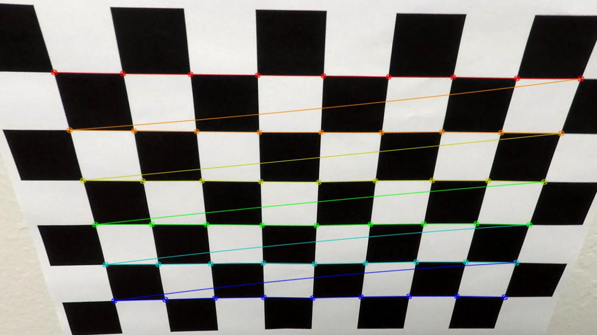
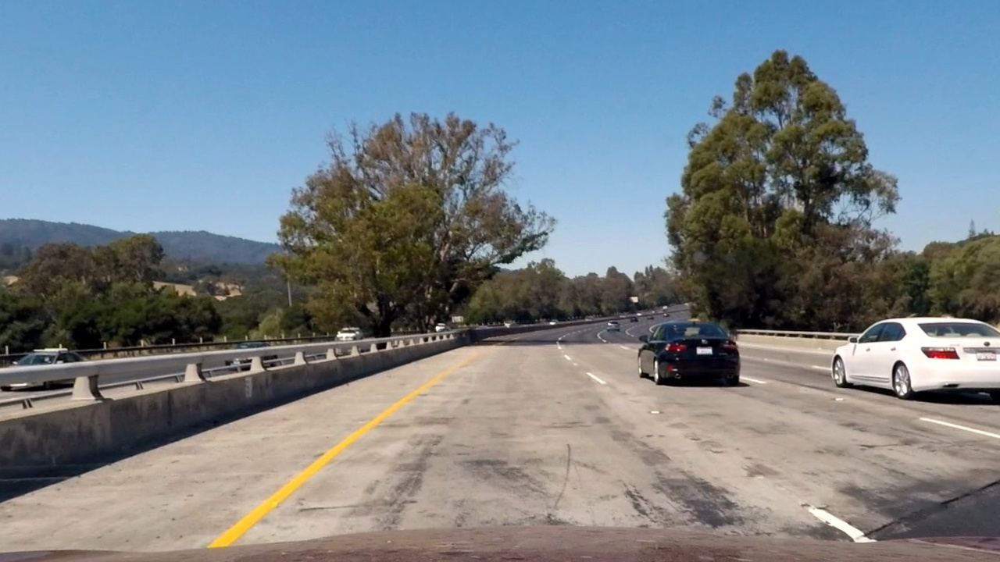
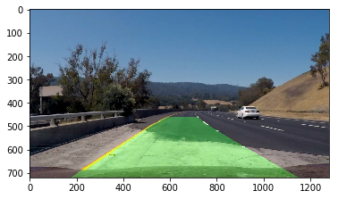

Project 4 - Advanced Lane Finding
=================================

This is the copy and the excerpts from the Jupyter notebook. Please see the [notebook](Project%204%20-%20Advanced%20Lane%20Finding.ipynb) for more details.

## Camera Calibration

### Briefly state how you computed the camera matrix and distortion coefficients. Provide an example of a distortion corrected calibration image.

I computed the camera matrix and distortion coefficients with the chessboard images using `cv2.calibrateCamera` and `cv2.undistort`. `cv2.calibrateCamera` gives the camera matrix and distortion coefficients. I will undistorte the images `cv2.undistort` with the parameters.

### Provide an example of a distortion-corrected image.

I'm listing the original and the undistorted images by the camera matrix and the distortion coefficents retrieved in the previous step side by side. The differences are recognizable when we see the edges of the images.

### Provide an example of a distortion-corrected image.

I'm listing the original and the undistorted images by the camera matrix and the distortion coefficents retrieved in the previous step side by side. The differences are recognizable when we see the edges of the images.

### Describe how (and identify where in your code) you used color transforms, gradients or other methods to create a thresholded binary image. Provide an example of a binary image result

I used the multiple combinations of the following thresholding techniques:

* Absolute gradient threshold for x and y orientations
* Magnitute gradient threshold
* Direction threshold
* HLS color threshold

Hue and Saturation of HSL color threshold give the solid base lane detection capabilities but they were not enough by themselves. Sometimes the color of the road is changed significantly and I had to use Lightness of HLS filtering its unecessary part out with other threshold.

Hue and Saturation couldn't detect the lane in the dark colored road as we can see in the "Color Binary Image" below but Lighness could. However, it had also detected the white car and the small part of the sky and I cut them out with the gradient and magnitude threshold filters, which well detected the rough outlines of the lanes in the dark color road.
I believe these combinations are the best as far as I tried and they detect the lanes in the project video very well so that I didn't need to interpolate lanes in the frames.

### Describe how (and identify where in your code) you performed a perspective transform and provide an example of a transformed image.

First I retrieve the points that create a trapezoid, not perfect though, which represents the rectangle of the road in the bird eye view on the strait lines1.jpg. Then I warped the image to map the corners into the ones on the image where corners shape the rectangle. Tthe x corrdinate of a side line is given by the mean of the original x coordinates of the two points make the line.

### Describe how (and identify where in your code) you identified lane-line pixels and fit their positions with a polynomial?

I employed the simple sliding window technique for finding the lanes. Possible lane points are collected in each window and the poly lines are calculated to fit the collected points. The histrogram shown below is helpful to see if the points are in the expected region and they form lines. Recognizable two peeks are good signs.

### Describe how (and identify where in your code) you calculated the radius of curvature of the lane and the position of the vehicle with respect to center.

I calculated the radius of the curvatures of the lanes using [the curvature formula](http://www.intmath.com/applications-differentiation/8-radius-curvature.php). I converted the unit of the curvatures from pixels to meters.

### Provide an example image of your result plotted back down onto the road such that the lane area is identified clearly.

I plotted the calculated poly lines with the inversion matrix, Minv, calculated in the warping step.

## Pipeline (video)

### Provide a link to your final video output. Your pipeline should perform reasonably well on the entire project video (wobbly lines are ok but no catastrophic failures that would cause the car to drive off the road!

I defined `detect_lane` function that wraps up all the steps above. It is a function takes the iamge and draw the are inside the lane. As additional features, it inserts the thresholded image and the image of the detected poly lines with colors corresponding to the current frame. It helps to get ideas of what's going on and eases the debugging a lot.

# Discussion¶

### Briefly discuss any problems / issues you faced in your implementation of this project. Where will your pipeline likely fail? What could you do to make it more robust?

My `detect_lane` function works very well for the simplest project video. However, it fails on the challenge videos that conains more steep curves, the tough lighting condition and the sudden interruption of the overtaking motorcycles/cars.

More time to tackle the challenge videos definitely is helpful but it would take much more time to tune the paramerters to make it work against the challenge video. And the lighting cant' be overcome with the color baesd threshold filters.

So I believe the fundamental change of the recognition method of the environment, such as other sensors, is required.
